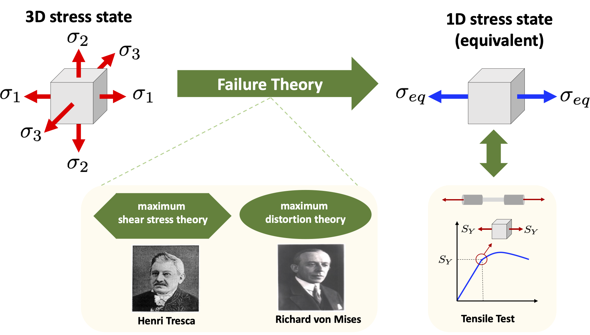

## Framework for Assessing Inherent Limitations and Uncertainties in Reliability Engineering

**FAILURE: Framework for Assessing Inherent Limitations and Uncertainties in Reliability Engineering** is a Matlab code designed to simulate the propagation of uncertainties in equivalent stress calculation problems subjected to uncertainties. This repository focuses on comparing the Tresca and von Mises failure criteria in a probabilistic context. 

<p align="center">

</p>

### Table of Contents
- [Overview](#overview)
- [Features](#features)
- [Usage](#usage)
- [Documentation](#documentation)
- [Authors](#authors)
- [Citing FAILURE](#citing-failure)
- [License](#license)
- [Institutional support](#institutional-support)
- [Funding](#funding)
- [Contact](#contact)

### Overview
**FAILURE** provides a framework for simulating and analyzing the propagation of uncertainties in stress calculations under different failure criteria. The main goal is to determine which criterion, Tresca or von Mises, is more conservative in a probabilistic context. More details can be found in the following paper:
- **A. Cunha Jr, Y. Yanik, C. Olivieri, and S. da Silva**, *Tresca vs. von Mises: Which failure criterion is more conservative in a probabilistic context?*, Journal of Applied Mechanics, 2023 (Accepted for publication) <a href="https://doi.org/10.1115/1.4063894" target="_blank">DOI</a>

### Features
- Simulates the propagation of uncertainties in equivalent stress calculations
- Compares Tresca and von Mises failure criteria
- Utilizes probabilistic methods for uncertainty quantification
- Educational style for intuitive use
- Includes example scripts for representative benchmark tests

### Usage
To get started with **FAILURE**, follow these steps:
1. Clone the repository:
   ```bash
   git clone https://github.com/yourusername/FAILURE.git
   ```
2. Navigate to the code directory:
   ```bash
   cd FAILURE/FAILURE-1.0
   ```
3. For failure analysis in a shaft, execute:
   ```bash
   Main_TrescaMises_Shaft
   ```
4. For failure analysis in a pressure vessel, execute:
   ```bash
   Main_TrescaMises_PressureVessel
   ```

### Documentation
**FAILURE** routines are well-commented to explain their functionality. Each routine includes a description of its purpose and a list of inputs and outputs. Examples with representative benchmark tests are provided to illustrate the code's functionality.

### Authors
- Americo Cunha Jr
- Yasar Yanik
- Carlo Olivieri
- Samuel da Silva

### Citing FAILURE
We ask the code users to cite the following manuscript in any publications reporting work done with our code:
- *A. Cunha Jr, Y. Yanik, C. Olivieri and S. da Silva, Tresca vs. von Mises: Which failure criterion is more conservative in a probabilistic context?, Journal of Applied Mechanics, 2023 (Accepted for publication) https://doi.org/10.1115/1.4063894*

```
@article{CunhaJr2023inpress,
   author  = {A {Cunha~Jr} and Y. Yanik and C. Olivieri and S. {da Silva}},
   title   = {Tresca vs. von Mises: Which failure criterion is more conservative in a probabilistic context?},
   journal = {Journal of Applied Mechanics},
   year    = {2023},
   volume  = {Accepted for publication},
   pages   = {~},
   doi     = {10.1115/1.4063894},
}
```

### License
**FAILURE** is released under the MIT license. See the LICENSE file for details. All new contributions must be made under the MIT license.

 

### Institutional support

 &nbsp; &nbsp;  &nbsp; &nbsp;  &nbsp; &nbsp; 

### Funding

 &nbsp; &nbsp;   &nbsp; &nbsp; &nbsp;  &nbsp; &nbsp; &nbsp;  
